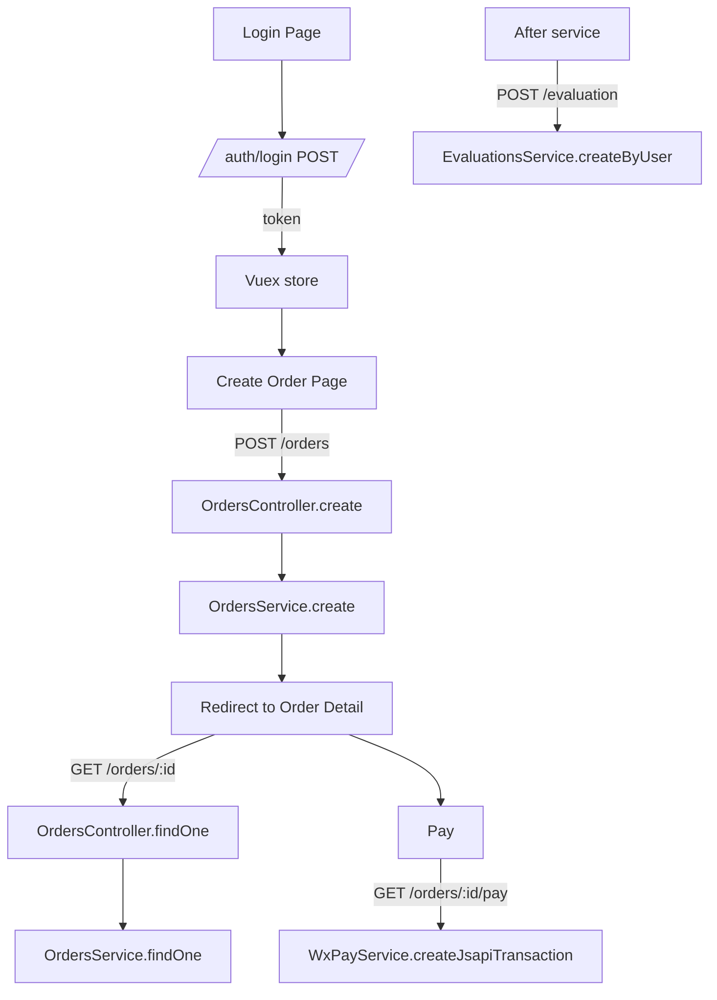
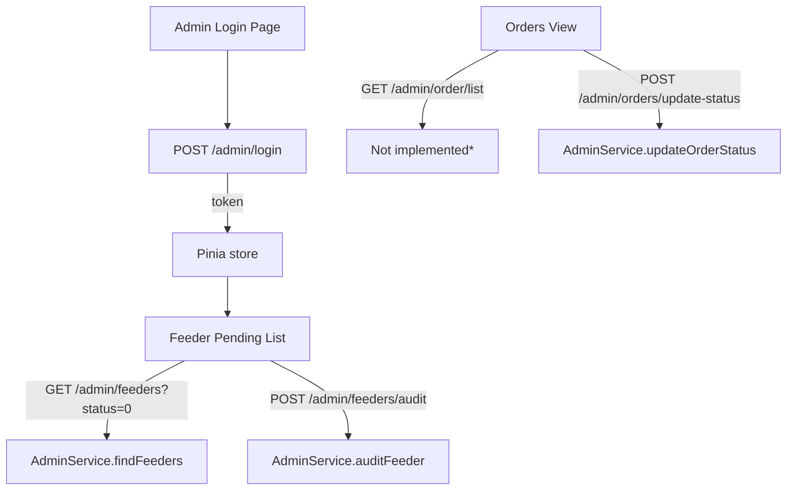

# Pet Feeding Service

This repository contains the backend and frontend code for the pet feeding mini-program project.

## Structure

- `backend/` - NestJS backend service
- `frontend/miniapp/` - Uni-app based WeChat mini-program
- `ui-tests/` - Example UI automation tests

- `frontend/admin/` - Naive UI based admin console

See `docs/ui-testing.md` for running the UI tests with miniprogram-automator.
Brand styles are configured in `frontend/miniapp/styles/theme.scss` and `frontend/admin`.
See [docs/admin-start.md](docs/admin-start.md) for running the admin console.

# 🗂 项目结构概览

## 🔧 后端（`backend/pet-feeder-backend`）

- 使用 **NestJS** 框架构建，核心模块包括认证、订单、喂养员管理等。
- 配置文件位于：`src/config`
- 主模块 `AppModule` 加载了以下子模块：
  - `orders`、`feeders`、`service-orders`、`reserve-orders`、`tracking`、`admin` 等
- 数据库结构：
  - 初始化脚本：`database-init.sql`
  - 命名规范：使用下划线命名法，添加业务前缀（admin_, user_, feeder_等）
  - 详细文档：`docs/database-setup.md`
  - 主要表结构包括：`admin_user`、`admin_role`、`admin_permission`、`admin_menu`等管理员系统表，以及`feeders`、`orders`、`messages`、`complaints`等业务表

## 🐾 小程序前端（`frontend/miniapp`）

- 基于 **uni-app + Vue2**
- 核心目录：
  - `pages/`：登录页、预约页、订单详情页等
  - `utils/`：封装 HTTP 请求、鉴权逻辑、WebSocket 聊天模块
  - `store/`：Vuex 状态管理
- 接口配置：
  - 基地址配置于 `config.js`
  - 所有请求通过 `utils/request.js` 封装，自动附带 JWT token

## 📋 管理后台前端（`frontend/admin`）

- 使用 **Naive UI + Vue3 + Pinia + Vue Router**
- 主要目录结构：
  - `api/`：封装管理后台接口（如喂养员审核、订单管理等）
  - `views/`：页面视图
  - `router/`：路由定义
  - `store/`：状态管理
- 启动说明见：`docs/admin-start.md`

## 🚚 喂养员小程序（`frontend/feeder-app`）

- 提供喂养员登录、订单接受、签到等功能
- 页面结构较为精简

---

# ✅ 后端模块与功能状态

| 模块                   | 职责                      | 主要接口/服务                             | 鉴权方式                            |
|----------------------|---------------------------|------------------------------------------|------------------------------------|
| **auth**             | 微信登录与 JWT 发放            | `/auth/login`, `/auth/profile`          | `JwtAuthGuard`                    |
| **users**            | 用户数据管理                  | RESTful `/users` 接口                    | 无                                 |
| **pets**             | 宠物管理，关联用户与喂养员         | `/pets`                                  | `JwtAuthGuard`, `RolesGuard`      |
| **feeders**          | 喂养员信息与申请接口              | `/feeders`, `/feeder/apply`             | `JwtAuthGuard` + 角色判断         |
| **feeder-schedules** | 喂养员排班                    | `/feeder-schedules/*`                    | `JwtAuthGuard` / `AdminJwtGuard`  |
| **orders**           | 用户下单与支付                  | `/orders`，支付回调接口                   | `JwtAuthGuard` + 用户角色         |
| **service-orders**   | 喂养员执行服务订单处理             | `/service-orders/:id/*`                 | 无                                 |
| **feeder-orders**    | 喂养员订单管理                  | `/feeder-orders/*`                       | `JwtAuthGuard` + 角色判断         |
| **reserve-orders**   | 多项服务预约订单                 | `/reserve-orders`                        | `JwtAuthGuard` + 角色判断         |
| **service-types**    | 服务类型目录                    | `/service-types`                         | `JwtAuthGuard` + 角色判断         |
| **evaluations**      | 用户或喂养员服务评价               | `/evaluation`                            | `JwtAuthGuard` + 角色判断         |
| **feedback**         | 用户反馈，关联订单                | `/feedback`                              | `JwtAuthGuard` + 角色判断         |
| **complaints**       | 订单投诉                       | `/complaint`                             | `JwtAuthGuard` + 角色判断         |
| **tracking**         | 服务追踪（如 WebSocket 实时状态）  | `/service/:id/status`                    | 无                                 |
| **im**               | 聊天系统（发送、历史记录）         | `/im/send`, `/im/history`               | `JwtAuthGuard`                    |
| **admin**            | 管理员登录、喂养员审核、订单管理等   | `/admin/login`, `/admin/feeders` 等接口 | `AdminJwtGuard` + 角色判断        |

---

# 🔁 前后端交互流程

## 1️⃣ 小程序用户流程：登录 → 下单 → 支付 → 评价

## 2️⃣ 管理后台流程：喂养员审核与订单管理

---

# 📌 其他观察与建议

- 登录流程中，`/auth/login` 当前只接受 openid，可能需引入 `WechatService.getSession(code)` 以支持传 code。
- `WxPayService` 实现尚不完整，建议补充微信支付签名验证、回调处理等模块。
- 管理后台接口权限控制良好，普遍使用 `AdminJwtGuard` 区分用户和管理员。